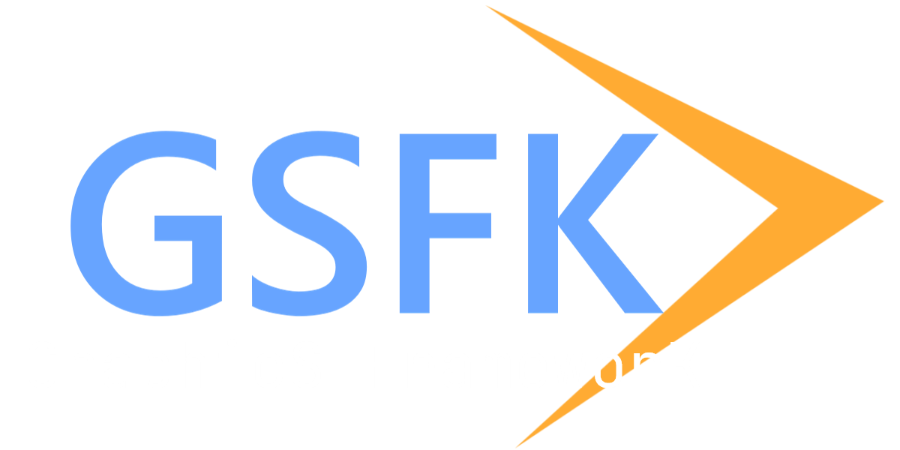

  
GSFK is an open source, cross-platform library for creating contexts and  
managing windows for each graphics API. 

## Status of support
### OpenGL
 - [X] Windows
 - [ ] Macos
 - [X] Xlib
 - [ ] Wayland

### Vulkan
- [X] Windows
- [ ] Macos
- [X] Xlib
- [ ] Wayland

### Direct2D
 - [ ] Windows

## Concept
 - GSFK abstracts away the tedious work required to use graphics APIs,  
and also defines a set of functions from the beginning to enable the use of various graphics APIs.

 - In addition, while OpenGL and Vulkan are cross-platform APIs,   
GSFK will also support the creation of contexts for platform-specific APIs such as Direct2D.

## Authors
 - Lattexshz

## License
GSFK is under MIT License